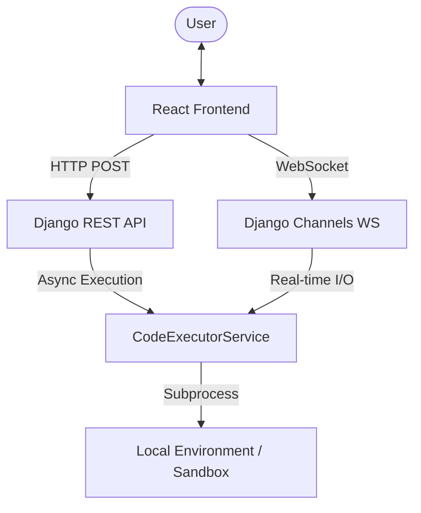

# Online Code Compiler: Technical Documentation

This document provides a comprehensive overview of the architecture, APIs, and workflow of the Online Code Compiler system.

---

## 🏗️ Architecture Overview

The system follows a modern **Frontend-Backend** architecture designed for real-time interactive code execution.

- **Frontend**: A React application built with Vite, utilizing [Monaco Editor](https://microsoft.github.io/monaco-editor/) for code editing and [xterm.js](https://xtermjs.org/) for terminal simulation.
- **Backend**: A Django project leveraging **Django Channels** for WebSocket communication and a dedicated service layer for secure code execution.

### High-Level Component Diagram


---

## 🌐 API Reference

### 1. HTTP API (Batch Execution)
Used for simple "Run and Get Result" operations without interactivity.

- **Endpoint**: `/api/compiler/execute/`
- **Method**: `POST`
- **Payload**:
  ```json
  {
    "language": "python",
    "code": "print('Hello World')",
    "input_data": ""
  }
  ```
- **Response**:
  ```json
  {
    "stdout": "Hello World\n",
    "stderr": "",
    "exit_code": 0
  }
  ```

### 2. WebSocket API (Interactive Execution)
Used for real-time terminal streaming and handling user input (e.g., `scanf`, `input()`).

- **Path**: `ws/compiler/execute/`
- **Actions**:
  - **`run`**: Starts code execution.
    ```json
    { "action": "run", "language": "python", "code": "..." }
    ```
  - **`input`**: Sends user input to the running process.
    ```json
    { "action": "input", "data": "John\r" }
    ```

- **Outbound Messages (Backend -> Frontend)**:
  - **`output`**: Streams data from stdout/stderr.
    ```json
    { "type": "output", "data": "H" }
    ```
  - **`exit`**: Sent when the process terminates.
    ```json
    { "type": "exit", "data": 0 }
    ```
  - **`error`**: Sent for system/connection errors.
    ```json
    { "type": "error", "data": "Message" }
    ```

---

## ⚙️ Backend Logic (`CodeExecutorService`)

The backend handles execution via the `apps/compiler/services/executor.py`.

### Execution Modes
1.  **Native Mode**: Uses local compilers/interpreters (e.g., `python`, `gcc`, `node`) installed on the server.
2.  **Simulation Mode**: For languages like **Apex** or **SQLite**, the system uses internal snippet interpreters to simulate execution without requiring full local environments.

### Process Isolation
- Every execution creates a **unique temporary directory**.
- Files are written to this directory (e.g., `solution.py`, `Main.java`).
- After execution (or WebSocket disconnection), the directory and all temporary files are **deleted automatically**.

---

## 💻 Frontend Implementation

### Core Components
| Component | Responsibility |
| :--- | :--- |
| `App.jsx` | State management (language, code), WebSocket lifecycle, execution triggering. |
| `Editor` | Monaco Editor integration with syntax highlighting for 10+ languages. |
| `Terminal` | Xterm.js wrapper that handles rendering ANSI colors and keyboard input. |

### Real-time I/O Flow
1. User clicks **"Run"**.
2. Frontend opens WebSocket and sends the `run` action with code.
3. Backend starts a `subprocess.Popen` with piped `stdin`, `stdout`, and `stderr`.
4. Dedicated threads in the backend read from the process pipes character-by-character and push messages to the WebSocket.
5. Frontend receives `output` and writes it directly to the terminal instance.
6. If the user types in the terminal, the `onData` event sends an `input` action back to the backend.
7. Backend writes the data to the process's `stdin.write()`.

---

## 🚀 Overall Workflow

1.  **Initialization**: User opens the app; frontend loads default code for Python.
2.  **Selection**: User changes language; frontend updates Monaco language configuration and default snippet.
3.  **Trigger**: User clicks "Run Code".
4.  **Connection**: Frontend instantiates a `WebSocket`.
5.  **Execution**: Backend receives request, saves code to a temp file, and identifies the correct compiler/interpreter.
6.  **Streaming**:
    - **Stdout/Stderr** -> WebSocket `output` -> Frontend Terminal.
    - **User Input** -> Frontend Terminal -> WebSocket `input` -> Backend Stdin.
7.  **Termination**: Process finishes; Backend sends `exit` code; Frontend closes WebSocket and shows "Process finished" message.
